# Week 3

## Exercise 2

### Assignment 1
select * from goal;
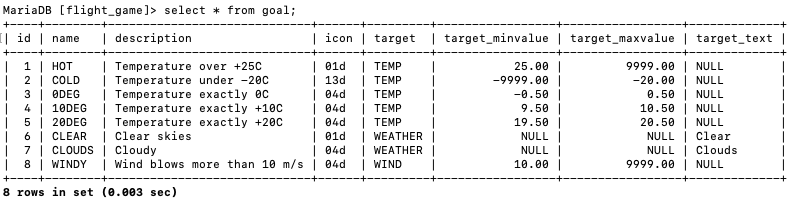

### Assignment 2
select name, type from airport where iso_country = "FI"; 

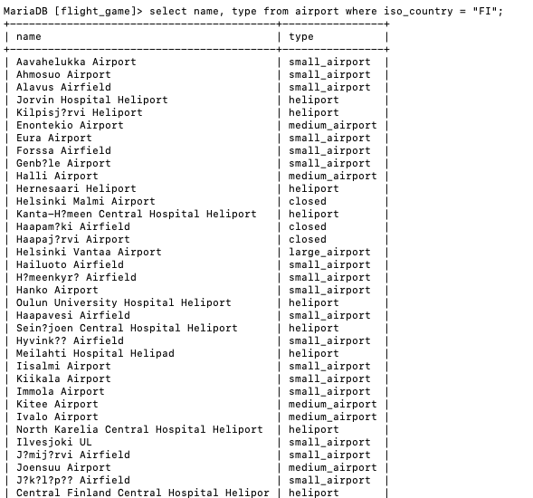

### Assignment 3
select name from airport where iso_country = "FI" order by name;

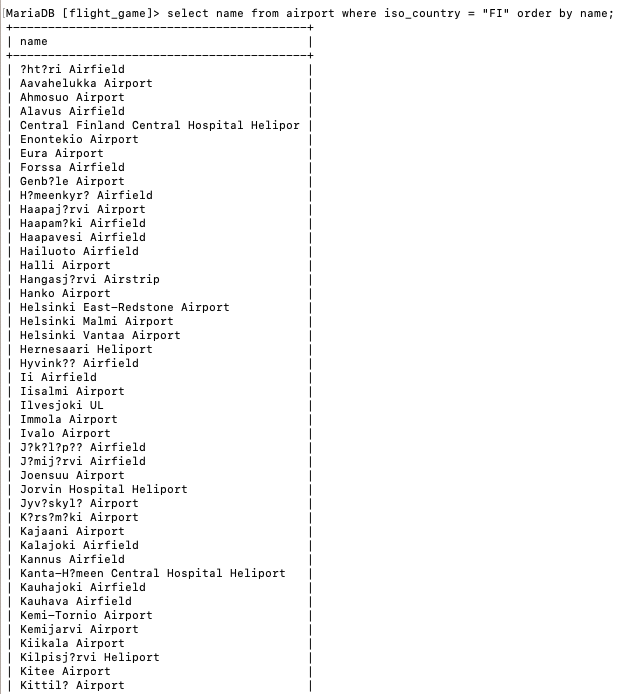

### Assignment 4
select name, type from airport where iso_country = "FI" order by type,name;

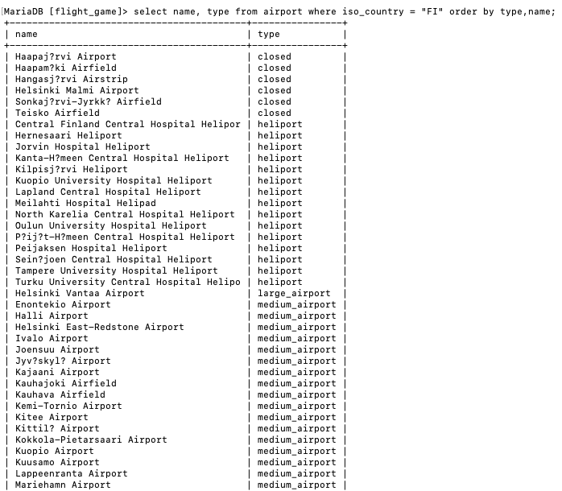

### Assignment 5
select name from country where name like "F%";

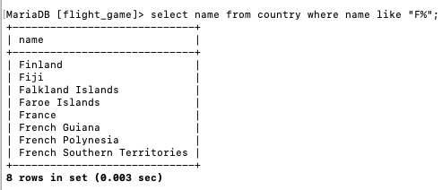

### Assignment 6
select name from country where name like "%F%";
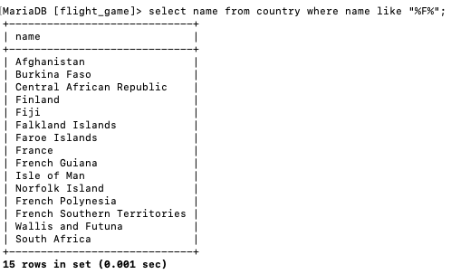

### Assignment 7
select location from game where screen_name = "Vesa";
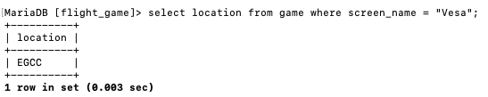

### Assignment 8
select co2_consumed from game where screen_name = "Ilkka";
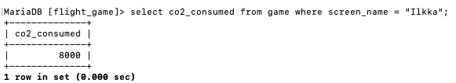

### Assignment 9
select co2_budget from game limit 1;
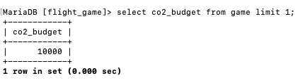

### Assignment 10
select co2_budget from game limit 1;
.png)
.png)

## Exercise 3

### Assignment 1
select country.name as "country name", airport.name as "airport name"
    -> from airport, country
    -> where airport.iso_country = country.iso_country and
    -> country.name = "Iceland";

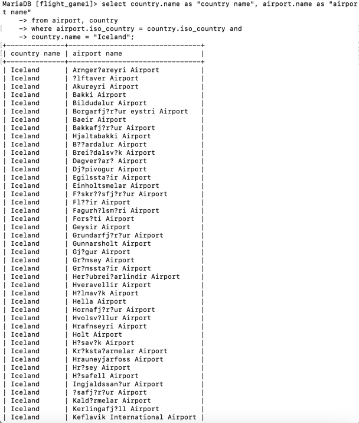

### Assignment 2
select name as "airport name"
    -> from airport
    -> where airport.iso_country = "FR" and
    -> airport.type = "large_airport";

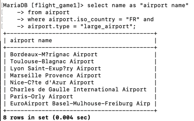

### Assignment 3
select country.name as "country name", airport.name as "airport name"
    -> from airport, country
    -> where airport.iso_country = country.iso_country and
    -> airport.continent = "AN";

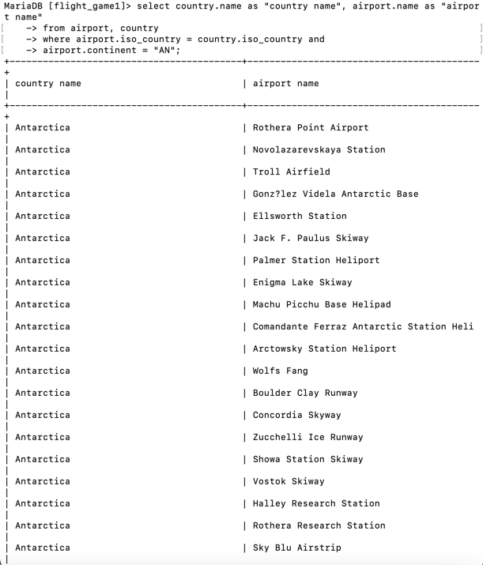

### Assignment 4
select elevation_ft
    -> from airport, game
    -> where game.location = airport.gps_code and
    -> game.screen_name = "Heini";

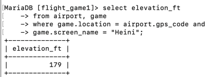

### Assignment 5
select elevation_ft *0.3048 as "elevation_m" 
    -> from airport, game
    -> where airport.gps_code = game.location and
    -> game.screen_name = "Heini";

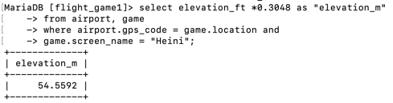

### Assignment 6
select name
    -> from airport, game
    -> where location = gps_code and
    -> screen_name = "Ilkka";

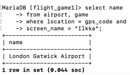

### Assignment 7
select country.name
    -> from airport, country, game
    -> where airport.iso_country = country.iso_country and
    -> location = gps_code and
    -> screen_name = "Ilkka";

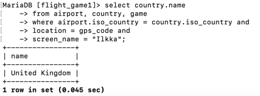

### Assignment 8
select goal.name
    -> from goal, game, goal_reached
    -> where game.id = goal_reached.game_id and
    -> goal_reached.goal_id = goal.id and
    -> screen_name = "Heini";

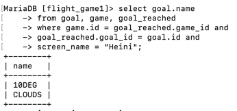

### Assignment 9
select airport.name 
    -> from airport, game, goal, goal_reached
    -> where game.id = goal_reached.game_id and
    -> goal.id = goal_reached.goal_id and
    -> location = gps_code and
    -> screen_name = "Ilkka";

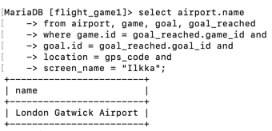

### Assignment 10
select country.name
    -> from airport, country, game, goal, goal_reached
    -> where goal_reached.goal_id = goal.id and
    -> goal_reached.game_id = game.id and
    -> location = gps_code and
    -> airport.iso_country = country.iso_country and
    -> screen_name = "Ilkka" and
    -> goal.name = "CLOUDS";

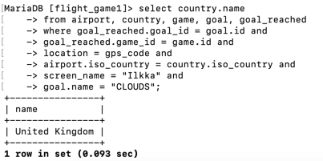

# Week 4

## Exercise 4

### Assignment 1
select country.name as "country name" , airport.name as "airport name"
    -> from airport
    -> inner join country on airport.iso_country = country.iso_country
    -> where country.name = "Finland" and
    -> scheduled_service = "Yes";

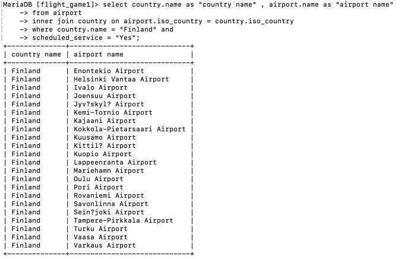

### Assignment 2
select game.screen_name, airport.name 
    -> from game
    -> inner join airport on game.location = airport.gps_code
    -> ;

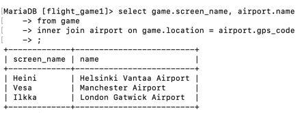

### Assignment 3
select screen_name, country.name
    -> from game
    -> inner join airport on location = gps_code
    -> inner join country on airport.iso_country = country.iso_country;

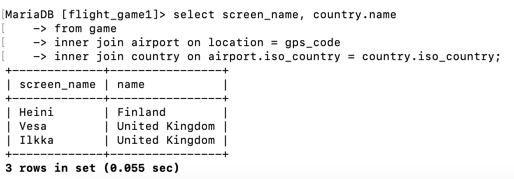

### Assignment 4
select airport.name, game.screen_name
    -> from airport
    -> left join game on location = gps_code
    -> where airport.name like "%Hels%";

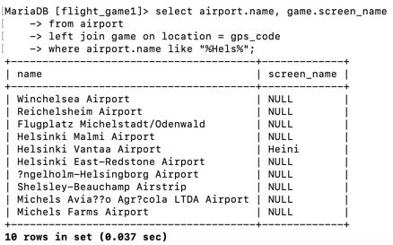

### Assignment 5
select goal.name, screen_name
    -> from goal
    -> left join goal_reached on goal_reached.goal_id = goal.id
    -> left join game on goal_reached.game_id = game.id
    -> ;

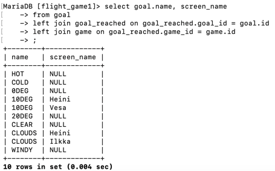

## Exercise 5

### Assignment 1
select name
    -> from country 
    -> where iso_country in(
    -> select iso_country 
    -> from airport 
    -> where name like "Satsuma%");

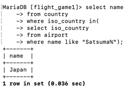

### Assignment 2
select name
    -> from airport
    -> where iso_country in(
    -> select iso_country from country
    -> where name = "Monaco");

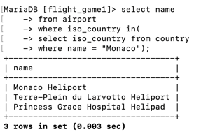

### Assignment 3
select screen_name 
    -> from game
    -> where id in(
    -> select game_id from goal_reached
    -> where goal_id in(
    -> select id from goal
    -> where name = "CLOUDS")
    -> );

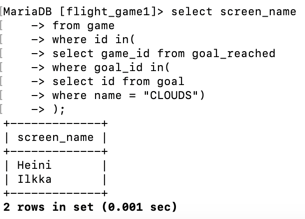

### Assignment 4
select name
    -> from country
    -> where iso_country not in(
    -> select iso_country from airport);

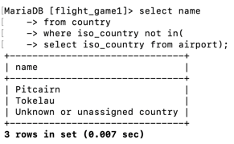

### Assignment 5
select name from goal
    -> where id not in(
    -> select goal_id from goal_reached
    -> where game_id in(
    -> select id from game
    -> where screen_name = "Heini"));

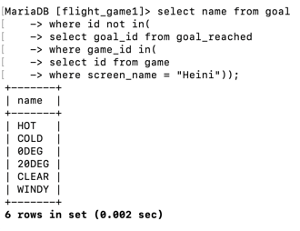

# Week 5

## Exercise 6

### Assignment 1
select max(elevation_ft) as "max(elevation_ft)" from airport;

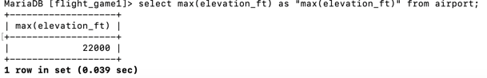

### Assignment 2
select continent, count(*)
    -> from country
    -> group by continent;
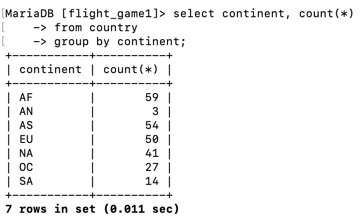

### Assignment 3
select screen_name, count(*)
    -> from game
    -> inner join goal_reached on goal_reached.game_id = game.id
    -> group by game.id;

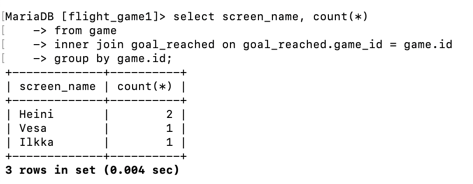

### Assignment 4
select screen_name
    -> from game
    -> where co2_consumed in(
    -> select min(co2_consumed) from game);

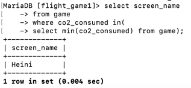

### Assignment 5
select country.name, count(*)
    -> from country
    -> inner join airport on airport.iso_country = country.iso_country
    -> group by country.name
    -> order by count(*) desc
    -> limit 50;

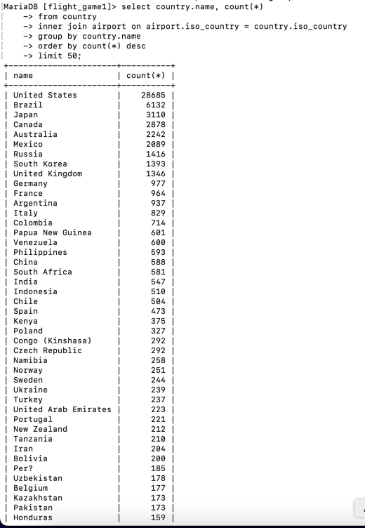

### Assignment 6
select country.name
    -> from country
    -> inner join airport on airport.iso_country = country.iso_country
    -> group by country.name
    -> having count(*) > 1000;

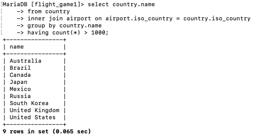

### Assignment 7
select name
    -> from airport
    -> where elevation_ft in (
    -> select max(elevation_ft) from airport);

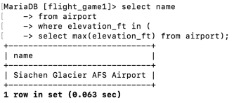

### Assignment 8
select name
    -> from country
    -> where country.iso_country in (
    -> select airport.iso_country from airport
    -> where elevation_ft in (
    -> select max(elevation_ft) from airport));

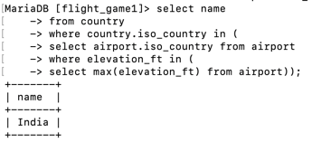

### Assignment 9
select count(*)
    -> from game
    -> inner join goal_reached on goal_reached.game_id = game.id
    -> where screen_name = "Vesa"
    -> group by screen_name;

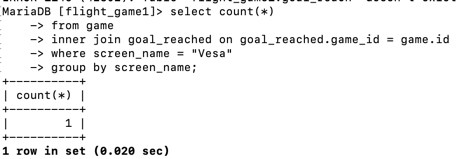

### Assignment 10
select name 
    -> from airport
    -> where latitude_deg in(
    -> select min(latitude_deg) from airport);

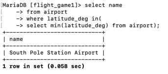

## Exercise 7

### Assignment 1
update game
    -> set location = (select ident from airport where airport.name = "Nottingham Airport"),
    -> co2_consumed = co2_consumed + 500
    -> where screen_name = "Vesa";
    
select * from game;

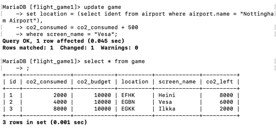

### Assignment 3
delete from goal_reached;
select * from goal_reached;

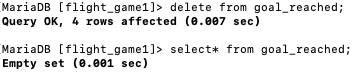

### Assignment 4
delete from game;
select * from game;

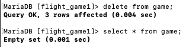